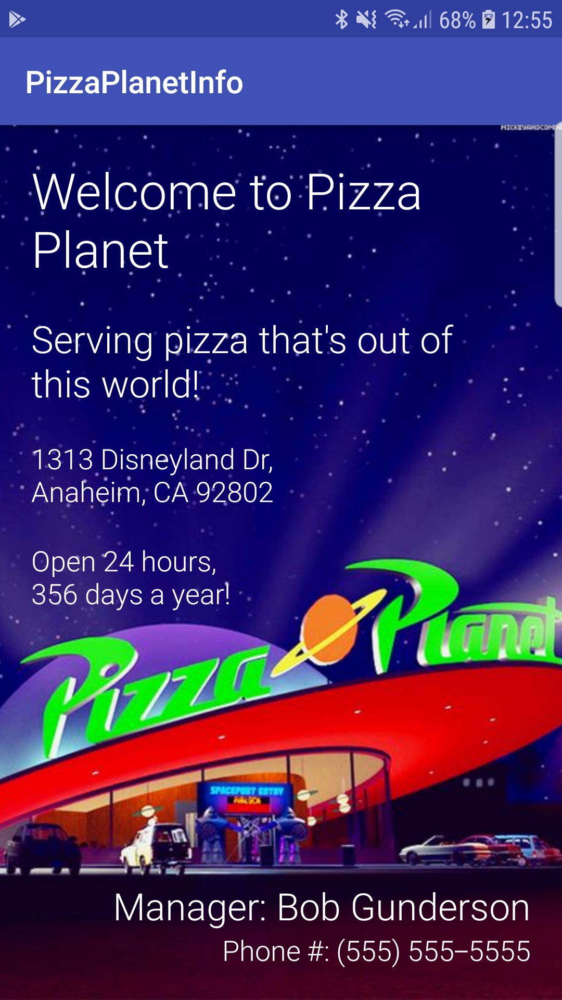

# Business Info App
Business info app for Udacity's Android Basics Nanodegree Program  
**Author**: Earl Jay Caoile  
**Version**: 1.0.0

## Overview
This Android app demonstrates a single page app displaying text and images.

## Getting Started
The following is required to run the program.
1. Android Studio or any IDE that supports Android software development (XML and Java)
2. Java JDK
3. A working emulator or Android phone to use the app

## Visual

## Credits
Image retrieved from the following URL: https://www.pinterest.com/pin/497014508849451273/

Tutorial provided by Udacity's Android Basics Nanodegree Program.